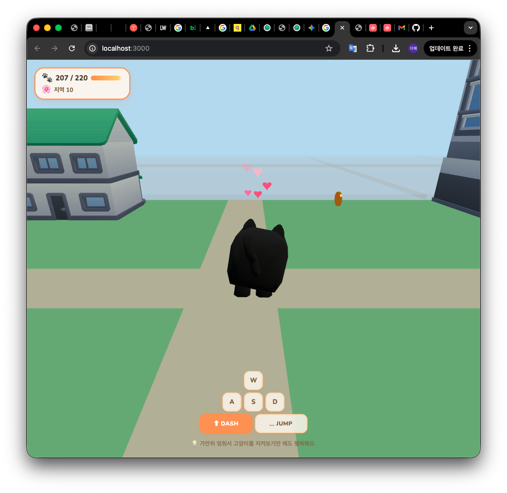

# 🐈 walk3d

> 고양이가 되어 걷는 작고 귀여운 3D 마을 게임

브라우저에서 바로 돌아가는 **로우폴리 힐링 3D 게임**.
아이템을 모으고, 레벨을 올리고, 새 지역을 언락하고, 가만히 있으면 고양이가 춤을 추며 하트를 띄운다. 그게 전부다.

<p align="center">
  
</p>

<p align="center">
  <a href="#quick-start"></a>
  
  
  
  
  
</p>

---

## ✨ 특징

- **절차적 마을 생성** — 무한하게 펼쳐지는 청크 월드, 같은 seed는 항상 같은 결과
- **4개 지역 언락** — Meadow / Harbor / Forest / Wildlands, 레벨업으로 자동 해제
- **3종 아이템 수집** — 별 · 코인 · 젬, 청크별 2–4개 스폰
- **물리 / 충돌** — 건물 충돌(X/Z 분리 슬라이딩), 지형 step, 점프/중력
- **카메라 투명화** — 고양이를 가리는 건물은 통째로 fade
- **하트 파티클** — 5초 idle 시 고양이가 춤추고 하트 떠오름
- **Freesound CC0 사운드** — 야옹 · 그르렁 · 발걸음, 점프/대시는 Web Audio 합성
- **localStorage 세이브** — 스키마 버전관리, 월드 seed 기반
- **ShaderMaterial 지형** — 지역별 파스텔 팔레트 + 격자 패턴
- **그라디언트 하늘 + 움직이는 구름** — 힐링 무드

---

## 🎮 조작

| 키 | 동작 |
|----|------|
| `W` `A` `S` `D` | 이동 |
| `Shift` | 대시 (속도 2× + 고양이 트릴 사운드) |
| `Space` | 점프 |
| (5초 가만히) | 그르렁 · 댄스 · 하트 ✨ |

---

## 🚀 Quick Start

```bash
# 1. 의존성 설치
npm install

# 2. 개발 서버 (http://localhost:3000)
npm run dev

# 3. 프로덕션 빌드
npm run build

# 4. 빌드 결과물 미리보기
npm run preview

# 5. 테스트 (65 tests · 9 files)
npm test
```

**요구사항**: Node 18+, 모던 브라우저 (Chrome 111+ / Safari 17+ / Firefox 115+)

---

## 🛠 기술 스택

| 영역 | 사용 기술 |
|------|-----------|
| **언어** | TypeScript 5.x (strict) |
| **3D 렌더** | Three.js r170, WebGL2, PCF Soft Shadow |
| **빌드** | Vite 6 (dev HMR + prod build) |
| **테스트** | Vitest 2.x |
| **오디오** | Web Audio API (합성 + PCM 재생) |
| **워커** | Web Worker (청크 프리패스) |
| **세이브** | localStorage + schema versioning |
| **에셋** | GLTF/GLB (GLTFLoader, SkeletonUtils) |

**빌드 사이즈**: 672KB → **177KB (gzip)**

---

## 📁 프로젝트 구조

```
walk3d/
├── src/
│   ├── main.ts                   # 게임 루프 (애니메이션 프레임)
│   ├── assets/
│   │   └── AssetManager.ts       # GLTF 로드/캐시/클론 (머티리얼 깊은 복제)
│   ├── camera/
│   │   └── ThirdPersonCamera.ts  # lerp 기반 3인칭 카메라
│   ├── character/
│   │   ├── Character.ts          # 고양이 메시 + 애니메이션
│   │   └── Controller.ts         # WASD → 속도 벡터 (순수 함수)
│   ├── game/
│   │   ├── ItemSystem.ts         # 수집/렌더/리스폰
│   │   ├── ProgressSystem.ts     # 레벨 · 임계값
│   │   ├── RegionManager.ts      # 지역 언락 상태
│   │   ├── SaveSystem.ts         # localStorage 저장소
│   │   ├── SoundSystem.ts        # Web Audio 재생 + 합성
│   │   ├── CollectFX.ts          # 아이템 수집 반짝임
│   │   └── HeartFX.ts            # idle 하트 파티클
│   ├── world/
│   │   ├── ChunkGenerator.ts     # 결정적 청크 데이터 생성
│   │   ├── ChunkManager.ts       # 플레이어 근처 3×3 청크 로드/언로드
│   │   ├── ChunkMeshFactory.ts   # 데이터 → Three.js 메시 변환
│   │   ├── RoadGrid.ts           # 도로/인도/엣지/대시 (non-overlap 타일)
│   │   ├── Buildings.ts          # 5종 건물 (GLTF + 절차적 폴백)
│   │   ├── Props.ts              # 소품 (나무/꽃/가로등/벤치/우체통)
│   │   ├── BuildingColliders.ts  # 원통 충돌 레지스트리
│   │   ├── Terrain.ts            # 높이맵
│   │   └── SkySystem.ts          # 그라디언트 돔 + 구름
│   ├── ui/
│   │   ├── HUD.ts                # 수집 진행도 + 지역
│   │   ├── ControlsHUD.ts        # WASD/DASH/JUMP 키가이드
│   │   └── RegionUnlockFX.ts     # 언락 오버레이
│   ├── utils/
│   │   ├── noise.ts              # simplex-noise 래퍼
│   │   ├── rng.ts                # seed 기반 PRNG
│   │   └── pool.ts               # 오브젝트 풀
│   └── workers/
│       └── chunkWorker.ts        # 청크 프리패스 워커
├── public/
│   ├── models/                   # GLB 에셋 (ASSETS.md 참조)
│   └── sounds/                   # OGG/WAV (CC0 Freesound)
├── docs/
│   ├── walk3d-v2.pptx            # 업데이트 리포트 (16:9 슬라이드)
│   ├── walk3d-v2.md              # Marp 슬라이드 마크다운 원본
│   └── build_pptx.py             # PPTX 생성 스크립트
├── ASSETS.md                     # 에셋 출처 · 라이선스
├── FIXES.md                      # v2 버그 수정 내역 (12건)
└── README.md
```

---

## 🎨 에셋 & 라이선스

모든 외부 에셋은 **CC0 / Public Domain**.

| 분류 | 출처 | 라이선스 |
|------|------|----------|
| 3D 건물 · 소품 | [Kenney](https://kenney.nl/assets) (City Kit / Nature Kit) | CC0 |
| 3D 캐릭터 | [Quaternius](https://quaternius.com) (RPG Animals, 추정) | CC0 |
| 사운드 | [Freesound.org](https://freesound.org) CC0 카테고리 | CC0 |

자세한 파일별 매핑은 [`ASSETS.md`](ASSETS.md) 참조.

> 모델 로드 실패 시 코드로 그려지는 **절차적 폴백**이 자동 동작하므로, 공개 레포에 에셋을 포함하지 않아도 게임은 돌아간다.

---

## 🧪 테스트

```bash
npm test
```

**65 tests · 9 files · 전부 통과**

| 파일 | 케이스 | 커버리지 |
|------|--------|----------|
| `SaveSystem.test.ts` | 7 | 세이브 로드/버전 마이그레이션 |
| `RegionManager.test.ts` | 15 | 지역 언락 조건 |
| `ProgressSystem.test.ts` | 12 | 레벨/임계값 |
| `ItemSystem.test.ts` | 9 | 아이템 수집 판정 |
| `ChunkGenerator.test.ts` | 4 | 결정적 생성 |
| `noise.test.ts` | 6 | 시드 노이즈 안정성 |
| `pool.test.ts` | 5 | 오브젝트 풀링 |
| `chunkWorker.test.ts` | 2 | 워커 메시지 |
| `Controller.test.ts` | 5 | 입력 매핑 |

---

## 🏗 개발 프로세스

이 프로젝트는 **[oh-my-claudecode (OMC)](https://github.com/wisbb/oh-my-claudecode)** 기반 멀티에이전트 파이프라인으로 개발됐다.

```
Deep Interview  →  RALPLAN-DR Consensus  →  Ralph PRD Loop
(요구사항 6라운드)    (Planner·Architect·Critic)   (12 stories 자동 실행)
   모호도 18%             합의 기반 계획                   검증·재시도·deslop
```

**산출물** (`.omc/`):
- `specs/deep-interview-walk3d.md` — 6 rounds, 모호도 18% PASSED
- `plans/walk3d-village-game.md` — RALPLAN-DR Consensus (SHORT)
- `prd.json` — 12 user stories (`US-001` ~ `US-012`) 전부 `passes: true`

**사용 에이전트**: `planner`, `architect`, `critic`, `executor`, `verifier`, `code-reviewer`, `ai-slop-cleaner`.
Writer-pass와 reviewer-pass를 분리해 **자기 승인 금지**.

자세한 흐름은 [`docs/walk3d-v2.pptx`](docs/walk3d-v2.pptx) 13–15 페이지.

---

## 📜 버그 수정 내역 (v2)

**3회차 · 12 issues resolved** — 자세한 원인/해결 패치 위치는 [`FIXES.md`](FIXES.md) 참조.

| 영역 | 주요 수정 |
|------|-----------|
| 월드 | 청크 좌표 `cx·32` → `(cx+0.5)·32`, 도로 셀 스킵 `&&` → `||`, 도로 밴드 소품 스킵 |
| 렌더 | 전역 Z-fighting(글로벌 바닥 중복 제거), 도로 교차점 non-overlap 레이아웃, 카메라→고양이 투명화 |
| 에셋 | GLTF 머티리얼 깊은 복제 (투명화 전염 방지), 가로등/나무/벤치 스케일 조정, 코인 `rotation.x = π/2` |
| 물리 | 원통 충돌 레지스트리 + X/Z 분리 슬라이딩 |
| 세이브 | `CURRENT_ITEM_SCHEMA_VERSION` 2 · 기존 좌표 invalidate |

---

## 🗺 로드맵

### 카메라 · 조작감
- [ ] 기본 카메라를 평소보다 약간 멀리+위에서 보기로 당기고, 5초 이상 서 있으면 현재 zoom으로 서서히 전환
- [ ] 대시 시 속도감 이펙트 (모션 블러 · FOV 살짝 확대 · 파티클 트레일)
- [ ] 대시 중 점프 → 일반 점프보다 더 높게 뜀
- [ ] 점프로 올라갈 수 있는 지형(낮은 플랫폼·바위·언덕) 추가

### 고양이 커스터마이징
- [ ] 고양이 색상 커스터마이징 UI (세이브 연동)
- [ ] 내 고양이 정보 인터페이스 (좌측 또는 우측 하단, 이름/레벨/수집/색상)
- [ ] 의상 · 액세서리 (리본 · 모자 등) 장착

### 월드 · 수집 콘텐츠
- [ ] 지역별 고유 네이밍 (예: "햇살 마을", "파도 항구")
- [ ] 지역별로 얻을 수 있는 아이템 종류 분류 (지역 × 아이템 매트릭스)
- [ ] 각 마을 필수 수집 아이템 (츄르 · 사냥 장난감 등 고양이 테마 아이템)
- [ ] 지역 5~8개로 확장 + 랜드마크
- [ ] 지역별 고유 건물 팔레트
- [ ] 일기 / 퀘스트 시스템 (마을 NPC 고양이)

### UI · 피드백
- [ ] 경계면(잠긴 지역/월드 끝) 닿았을 때 토스트 메시지
- [ ] 수집/언락 히스토리 타임라인
- [ ] 모바일 가상 조이스틱

### 환경 · 무드
- [ ] 밤/낮 셰이더 · 날씨 (비/눈 파티클)
- [ ] 계절감 BGM (지역별 오프셋)

### 빌드 · 성능
- [ ] 코드 스플리팅 (현재 단일 672KB → dynamic import 청크화)
- [ ] KTX2/Basis 압축 텍스처

---

## 🤝 기여

이 레포는 개인 프로젝트지만, 이슈/PR은 환영합니다. 기여 전:

1. `npm test` 통과 확인
2. `npm run build` 타입 체크 + 빌드 성공 확인
3. 새 기능은 해당 파일에 Vitest 테스트 추가
4. 커밋 메시지는 `feat:` / `fix:` / `docs:` / `refactor:` / `test:` prefix

---

## 📄 라이선스

**MIT License**

에셋 라이선스는 별도 (`ASSETS.md` 참조) — 모두 CC0.

---

<p align="center">
  <i>"가만히 멈춰서 고양이를 지켜보기만 해도 행복해요" 🐾</i>
</p>
